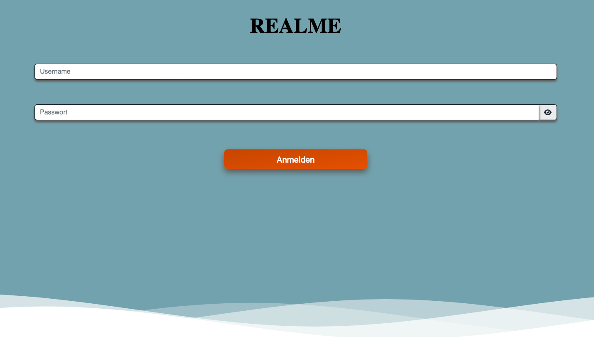

## Installation

### Backend
In the project-directory:
```bash
cd backend
npm install
```

### Frontend
In the project-directory:
```bash
cd backend
npm install
```

## Start

Run npm run start:

### Backend
In the project-directory:
```bash
cd backend
npm run start
```

### Frontend
In the project-directory:
```bash
cd frontend
npm run start
```

### Ready
Now you are ready to open http://localhost:4200 and to create your own profile!

If you want to go to the Strapi-Admin-Interface, you have to go to http://localhost:1337.
There you can login with:

    - E-Mail: marc.troell@mni.thm.de
    
    - Password: CMS-Realme2023

## Feautures

Project implements basic Features of a Social Media Application and some special Features such as:

```python
Basic Features

Login
Register
Create Account
Delete Account
Update Account
Upload Picture
Delete Pictures
Comment on Pictures
Redirecting to User when clicked on Profile Picture
Report Comments
Report Pictures
Follow other Accounts
See who is following you
Change Passwort


Special Features

Rating Pictures
Having a Rank
Saving Username after logout
Saving Profile Picture after logout 
Dynamic UI
Foryou Page (People you follow)
Discovery Page (Community Posts)


```

## Frameworks and Libraries
Used Frameworks an Libraries
```python
Strapi (Backend)
Node js
Rest Api
Angular (Frontend)
Bootstrap
Fontawesome 


```

Thank you for your interest in our Project.

Now you are ready to get to know the RealMe :)


